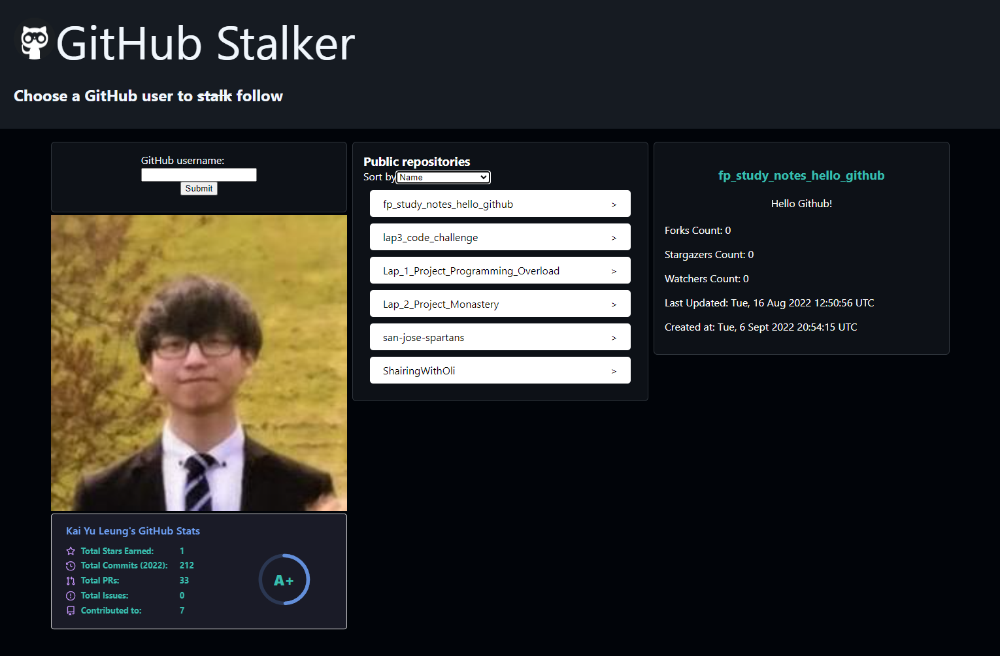
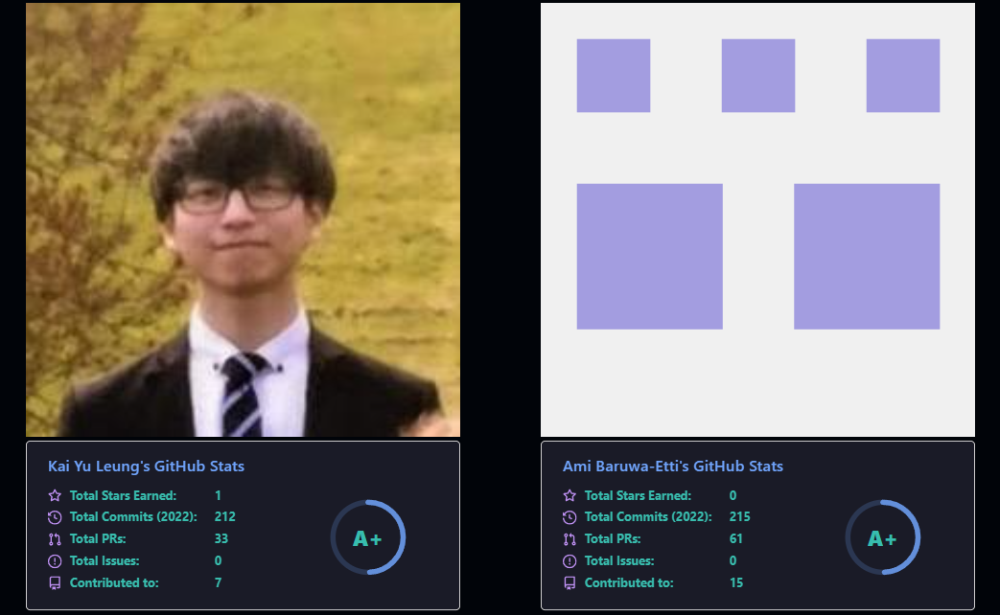

# GitHub Stalker

This project was to make a GitHub user tracker app

## Team members

This is done in 3 days, with a team of 2, Kai and Ami.

## Install and Usage

### Deployed website:
https://ghstalker.netlify.app/

### Development:
`npm start`\
Runs the app in the development mode.\
Open [http://localhost:3000](http://localhost:3000) to view it in your browser.

The page will reload when you make changes.\
You may also see any lint errors in the console.

<!-- ## Excalidraw:
https://excalidraw.com/#room=216106ec835cb775249e,nM_bXxx0JpMpoQpxeYnzxQ -->
